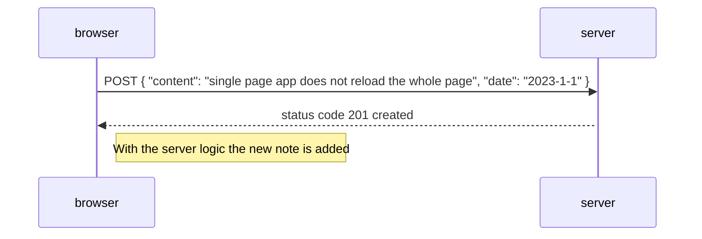

```mermaid
sequenceDiagram

    participant browser
    participant server

        browser->>server: POST { "content": "single page app does not reload the whole page", "date": "2023-1-1" }
        activate server

        server-->>browser: status code 201 created

        Note right of browser: With the server logic the new note is added

```
